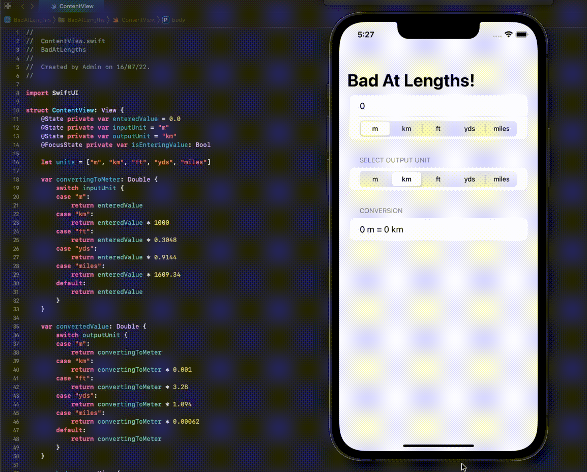

# BadAtLengths!

This is a challenge Project for [day 19](https://www.hackingwithswift.com/100/swiftui/19) of 100DaysOfSwiftUI by @twostraws.

## Challenge Statement

- The challenge requires you to make a unit conversion tool of some type.
- It can be for lengths, volume, currencies or temperature.
- I chose units of lengths!

## Structure of the app

- The app can be broken down into 3 sections.
  1. This section takes the input value and unit from the user. The TextField uses a decimal keypad and the unit is selected using a segmented picker.
  2. The second section let's the user choose the unit they would like to convert their input to. This is also a segmented picker.
  3. The third section shows the conversion output.
- The units options come from the array `["m", "km", "ft", "yds", "miles"]`.
- The user can choose any input unit. The entered data will always be converted to metres first and then to the required unit for the simplicity of calculations.

## Learnings

- SwiftUI makes you think in terms of states. The impulse is to just call a specific function.
- I am glad to get started working on a independent project this early on because it is helping me adapt to the different type of approach SwiftUI takes.

This was a fun little project. On to the next one! 🚀

[Link to my 100DaysOfSwiftUI repo](https://github.com/SaurabhJamadagni/100DaysOfSwiftUI)

Thanks for reading! Let's connect on [Twitter](https://twitter.com/Saura6hJ) 👋
